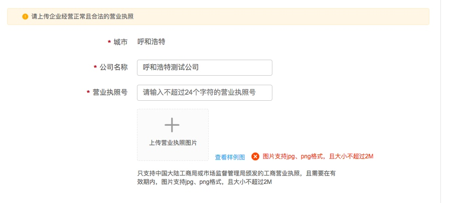
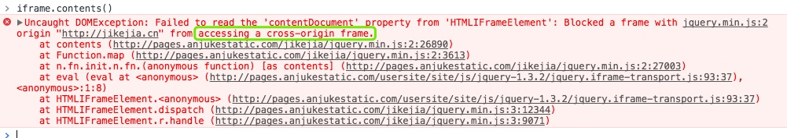
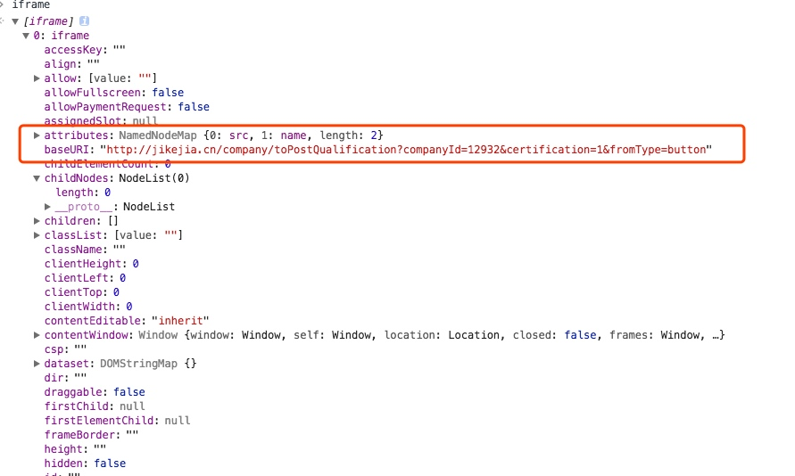
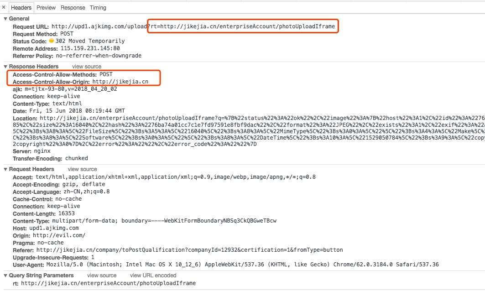
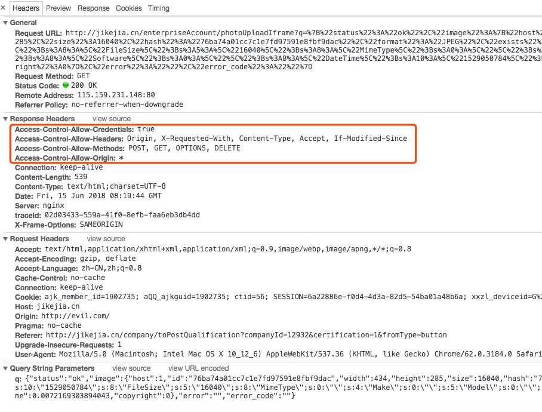

##  记一次难忘设置document.domain引起的跨域
 
 

#### 1、背景介绍：

```
接到QA说图片上传失败，在自己本地没有重现，多台电脑第一次成功上传，第二次后失败。
1. 回退今天上线的内容没有解决问题，
    * 排除今天上线代码原因
2. 和后端确认 => 【回复】最近没有改过相关内容
3. 和图片上传服务提供确认 => 【回复】最近没有改过相关内容
4. 心里想....纳尼~~~
```

#### 2、分析定位问题

上传营业执照 使用jQuery-File-Upload 来实现
里面通过[Cross-domain File Uploads](https://github.com/blueimp/jQuery-File-Upload/wiki/Cross-domain-uploads) 使用 [Iframe Transport plugin](https://github.com/blueimp/jQuery-File-Upload/blob/master/js/jquery.iframe-transport.js) 来重定向到当前域名并获取返回值

jquery.iframe-transport.js
文件内部获取iframe显示内容的方法

```
try {
    response = iframe.contents();
    // Google Chrome and Firefox do not throw an
    // exception when calling iframe.contents() on
    // cross-domain requests, so we unify the response:
    if (!response.length || !response[0].firstChild) {
        throw new Error();
    }
} catch (e) {
    response = undefined;
}
```

iframe.contents()获取内容报错



#### 3、正常寻找原因

查看iframe的baseURI和页面 `http://jikejia.cn` 是同域的


```
分析请求头
```
上传文件请求头


重定向后请求头


没毛病~~ 纳尼~~~~ 怎么可能 ~~~~

#### 4、开启非常规手段
同样的代码在`http://jikejia.cn`上出错，`http://mendian.58ganji.com`和`jikejia.anjuke.test`域名上是正常的。

通过排查最近上线的前端项目发现，最近为了解决指纹相关的js error， 提供方提供一个解决方案 
`document.domain="jikejia.cn"`
把这段代码删除后，问题解决了......

#### 5、为什么
一切的现象都是有根据的

1. 跨域的两个文件可以通过设置domain来实现跨域。
2. 脚本可以将 document.domain 的值设置为其当前域或其当前域的超级域
3. 修改文件没有添加版本
4. 图片上传优先使用flash

```
注：
使用 document.domain 来允许子域安全访问其父域时，您需要在父域和子域中设置 document.domain 为相同的值。这是必要的，即使这样做只是将父域设置回其原始值。不这样做可能会导致权限错误
```

#### 6、这个问题带来的思考

***
参考资料
[官方文档-英文](https://developer.mozilla.org/en-US/docs/Web/Security/Same-origin_policy)
[官方文档-中文](https://developer.mozilla.org/zh-CN/docs/Web/Security/Same-origin_policy)
[修改document.domain的注意事项](http://www.cnblogs.com/jkisjk/archive/2013/05/30/change_document_domain.html)


